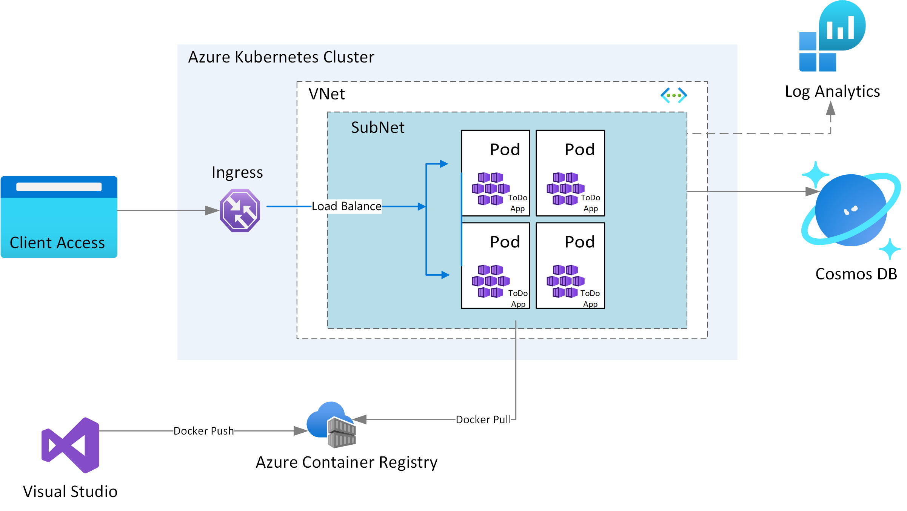

# Terraform and Azure Service Operator to configure an application with a CosmosDB backend
## Overview

This README will walk through project3 requirements.  You will be using [Terraform](https://www.terraform.io/) and [Azure Service Operators(ASO)](https://devblogs.microsoft.com/cse/2021/11/11/azure-service-operators-a-kubernetes-native-way-of-deploying-azure-resources/).
* You will create terraform modules to create the AKS cluster and networking
* You will use ASO to build and deploy CosmosDB in the cluster
* you will deploy the infrastructure using Azure pipelines

The terraform modules will provision the following Azure resources.
1. A Resource Group
2. A Managed Identity
3. Azure Container Registry for storing images
4. A VNet required for configuring the AKS
5. A AKS Cluster

ASO will do the  following
1. Provision a Cosmos DB SQL API Account along with a Database, and a Container (CosmosDB will be replicated and strongly consistent)
2. Host the sample application

### Architecture



---
# Set up Azure Service Operator

**1. Install Azure Service Operator**

Follow [these instructions](https://github.com/Azure/azure-service-operator/tree/master/v2#installation) to install the ASO v2 operator in your cluster.

The ASO is installed in your cluster and propagates changes to resources there to the Azure Resource Manager.
[Read more about how ASO works](https://github.com/azure/azure-service-operator#what-is-it)

---
# Deploy Cosmos DB with ASO

ASO helps you provision Azure resources and connect your applications to them from within Kubernetes. If you want to use Azure resources but would prefer to manage those resources using Kubernetes tooling and primitives (for example kubectl apply).

Create a `yaml file` that will do the following:

* Create A Kubernetes namespace named `{Anything you want}`
* An new Azure Resource Group `apiversion resources.azure.com/v1beta20200601`(Although having services for the same workload in multiple resource groups is an anti-pattern. We recommend a new resource group here so that deleting the deployment doesn't remove the primary resource group along with all its contained resources)
* A Cosmos DB SQL API account, 
* a database
* and a container `apiversion documentdb.azure.com/v1beta20210515`
---
## ([Sample ASO yaml files](https://github.com/Azure/azure-service-operator/tree/main/v2/config/samples) )
---


Apply the database `yaml file` you just created

The operator will start creating the Cosmos DB account, database, and container in Azure. You can monitor their progress with:

You can use lens to monitor the deployment

---
# Configure RBAC in Azure Cosmos DB

**1. Create a SQL role definition**

Create a JSON template for a SQL role definition as explained [here](https://docs.microsoft.com/cli/azure/cosmosdb/sql/role/definition?view=azure-cli-latest#az-cosmosdb-sql-role-definition-create), save it as sql-role-definition.json. 
Roles you will need:
```azurecli  
  "Microsoft.DocumentDB/databaseAccounts/readMetadata",
  "Microsoft.DocumentDB/databaseAccounts/sqlDatabases/containers/executeQuery",
  "Microsoft.DocumentDB/databaseAccounts/sqlDatabases/containers/readChangeFeed",
  "Microsoft.DocumentDB/databaseAccounts/sqlDatabases/containers/items/read",
  "Microsoft.DocumentDB/databaseAccounts/sqlDatabases/containers/items/upsert",
  "Microsoft.DocumentDB/databaseAccounts/sqlDatabases/containers/items/create"
```
Create a SQL role definition under an Azure Cosmos DB account using the JSON file. 

**2. Assignment of SQL Role in Cosmos DB**

Create the SQL role assignment under the Azure Cosmos DB account for the managed identity you created

---
# Sample Application Deployment

**1. Push the container image to Azure Container Registry**

The application can be built and pushed to ACR using Visual Studio or VS Code. Use any of the two methods given below

**Using Visual Studio**

Prerequisites: 
* [Docker Desktop](https://docs.docker.com/desktop/)
* [Visual Studio 2022](https://visualstudio.microsoft.com/downloads) with the Web Development, Azure Tools workload, and/or .NET Core cross-platform development workload installed
* [.NET Core Development Tools](https://dotnet.microsoft.com/download/dotnet-core/) for development with .NET Core

Build the application source code available in the Application folder, and then [publish the container image to the ACR](https://docs.microsoft.com/visualstudio/containers/hosting-web-apps-in-docker?view=vs-2022).

**Using Visual Studio Code**

Prerequisites:
* [Docker Desktop](https://docs.docker.com/desktop/)
* [Visual Studio Code](https://code.visualstudio.com/)
* [C# for Visual Studio Code](https://marketplace.visualstudio.com/items?itemName=ms-dotnettools.csharp)
* [Docker extension for Visual Studio Code](https://code.visualstudio.com/docs/containers/overview)
* [Azure Account extension for Visual Studio Code](https://marketplace.visualstudio.com/items?itemName=ms-vscode.azure-account)

    1. To build the code, open the Application folder in VS code. Select Yes to the warning message to add the missing build and debug assets. Pressing the F5 button to run the application.

    2. To create a container image from the Explorer tab on VS Code, right click on the Dokcerfile and select BuildImage. You will then get a prompt asking for the name and version to tag the image. Type todo:latest.

        

    3. To push the built image to ACR open the Docker tab.You will find the built image under the Images node. Open the todo node, right-click on latest and select "Push...". You will then get prompts to select your Azure Subscription, ACR, and Image tag. Image tag format should be {acrname}.azurecr.io/todo:latest.

        

    4. Wait for VS Code  to push the  image to ACR.

**2. Create pod secrets**

Pod Secrets provides a mechanism to hold sensitive information in the AKS cluster and pass it to the pods. 

create a pod secret for the CosmosEndpoint. (hint you can create a generic secret using the kubectl command)


**3. App Deployment YAML**

Create deployment yaml file to create a deployment using the secret in the previous step, and a service of type loadbalancer

Deploy the yaml file. 

get the external ip and access the application in your browser

---
# Continuous Integration and Delivery

You will deploy the infrastructure in a pipeline in azure devops
You will deploy the application in another pipeline in azure devops

These pipelines will be independent of one another

